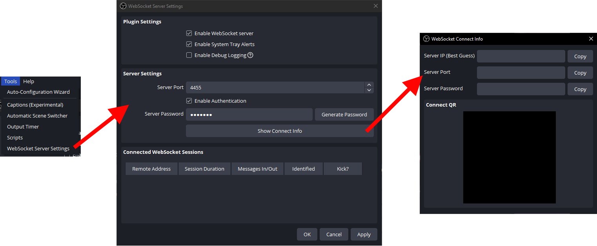

# OBSControl

A Beat Saber mod to automatically start/stop recording in OBS when you play a song.

## Installation

### OBS

Navigate to the `Tools` menu in OBS and locate the `WebSocket Server Settings`. From This menu, you will want to make a note of your connection info, specifically the Server IP, Server Port, and Server Password. You will need to enter this info into the mod's settings in the game.

  

### Beat Saber

> [!IMPORTANT]
> In addition to BSIPA, you must have [SiraUtil](https://github.com/Auros/SiraUtil), and [BeatSaberMarkupLanguage](https://github.com/monkeymanboy/BeatSaberMarkupLanguage) installed for this mod to load. Install them using your mod manager i.e. [BSManager](https://bsmg.wiki/pc-modding.html#bsmanager).

Place the contents of the unzipped folder from the latest [release](https://github.com/qqrz997/OBSControl/releases/latest) into your Beat Saber installation folder. If you need more information regarding manual installation of mods [this wiki page](https://bsmg.wiki/pc-modding.html#manual-installation) will help. For further help with installing mods, join the [Beat Saber Modding Group](https://discord.gg/beatsabermods) discord server.

Older versions of OBSControl are not supported. If you find issues using an older version then I won't be able to help.
  
## Configuration

Settings can be found in-game in the `Mod Settings` menu which can be found next to `Settings`.

### Advanced

Available only by editing `OBSControl.json` in your `Beat Saber\UserData` folder

- RecordingFileFormat: Defines how the file will be renamed after the recording stops.
  - Substitution characters are prefixed with `?`
  - Optional groups are bounded by `<` `>`
    - The group is only shown if one or more of the substitutions inside the group are not empty strings.
      - Example: The format `VideoFile<_I_Got_A_?F>` will be `VideoFile_I_Got_A_FC` if you get a full combo or `VideoFile` if you don't.
  - Optional parameters: Some substitutions can have additional parameters inside { }. For example, the format `?@{yyyyMMddHHmm}` would rename the file to `202005050807.mkv` on 05/05/2020 8:07 AM.

### File Name Substitutions

- Song Data

|Key|Substitution|Parameter(s)| Notes |
|---|---|---|---|
|B|BeatsPerMinute||BPM to two decimal places, ignoring trailing zeroes.|
|D|DifficultyName||Full name of the difficulty.|
|d|DifficultyShortName||Short name of the difficulty (i.e `E+` instead of `ExpertPlus`).|
|A|LevelAuthorName|(int)Max Length|Name of the mapper. Example: `?A{10}` to use up to 10 characters of the mapper name.|
|a|SongAuthorName|(int)Max Length|Name of the song artist. Example: `?a{10}` to use up to 10 characters of the artist name.|
|@|CurrentTime|(string)DateTimeFormat|Date/Time of the recording when stopped. [Format Information](https://docs.microsoft.com/en-us/dotnet/standard/base-types/custom-date-and-time-format-strings), default is `yyyyMMddHHmm`|
|I|LevelId||LevelId of the song.|
|J|NoteJumpSpeed||NJS to two decimal places, ignoring trailing 0s.|
|L|SongDurationLabeled||Duration of the song in minutes and seconds (i.e. `3m.25s` for 3 min 25 sec).|
|l|SongDurationNoLabels||Duration of the song in minutes and seconds with no labels (i.e. `3.25` for 3 min 25 sec).|
|N|SongName|(int)Max Length|Name of the song. Example: `?N{10}` to use up to 10 characters of the song name.|
|n|SongSubName|(int)Max length|Subname of the song. Example: `?n{10}` to use up to 10 characters of the song subname.|

- Completion Results Data

|Key|Substitution|Parameter(s)|Notes|
|---|---|---|---|
|1|FirstPlay||`1st` if you haven't played the song according to Beat Saber's data.|
|b|BadCutsCount||Number of bad cuts.|
|T|EndSongTimeLabeled||How far into the song you got in minutes and seconds (i.e. `3m.25s` for 3 min 25 sec).|
|t|EndSongTimeNoLabels||How far into the song you got in minutes and seconds with no labels (i.e. `3.25` for 3 min 25 sec).|
|F|FullCombo||`FC` if you full combo'd the song.|
|M|Modifiers||Enabled song modifiers, separated by `_` (i.e. `DA_FS` for Disappearing Arrows and Faster Song).|
|m|MissedCount||Number of notes missed.|
|G|GoodCutsCount||Number of good cuts.|
|E|LevelEndType||Has a value for any level end type (`Cleared`/`Quit`/`Failed`/`Unknown`).|
|e|LevelIncompleteType||Only has a value if the level was incomplete (`Quit`/`Failed`/`Unknown`).|
|C|MaxCombo||Max combo for the song.|
|S|RawScore||Score before any modifiers were applied.|
|s|ModifiedScore||Score after modifiers (your actual score).|
|R|Rank||Score rank (`SSS`/`SS`/`S`/`A`/`B`/`C`/`D`/`E`).|
|%|ScorePercent|| Score percent to two decimal places.|
